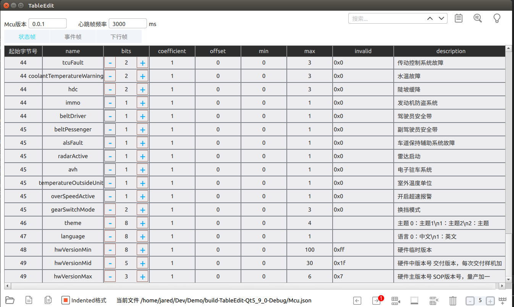

# TableEdit

## 简介：

这是一个使用Qt + qml制作的表格编辑器。

主要围绕TableView控件做一系列功能拓展。

TableView对应的数据model，使用Qml/ListModel，数据的创建、导入等操作，全部使用qml/js实现。

引入了JSONPath，快速访问JSON并转化到ListModel。

内容上有些汽车行业相关的文字，请忽略。

工程里面也有一些常用组件的封装，比如Slack风格的按钮、带三角形箭头的ToolTip、Popup自定义弹窗等。

## 效果图：

## 功能：

* 从特定格式JSON文件导入数据
* 从表格导出数据到JSON文件
* 从表格独立创建数据
* 表格列的定制（不同的列用不同的组件和数据类型）
* 编辑表格内容，包括以行为单位的增、删、改、查
* 对行的增、删、改、查 操作，可以进行撤销、恢复
* 其它一些特殊规则的内容校验

## 开发环境

* Qt 5.9.0 Windows/Ubuntu

